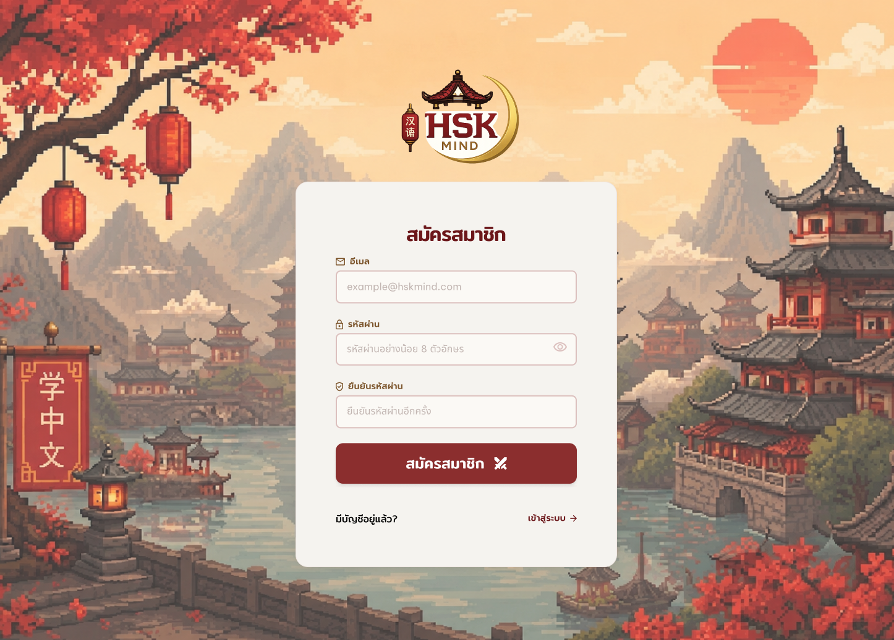
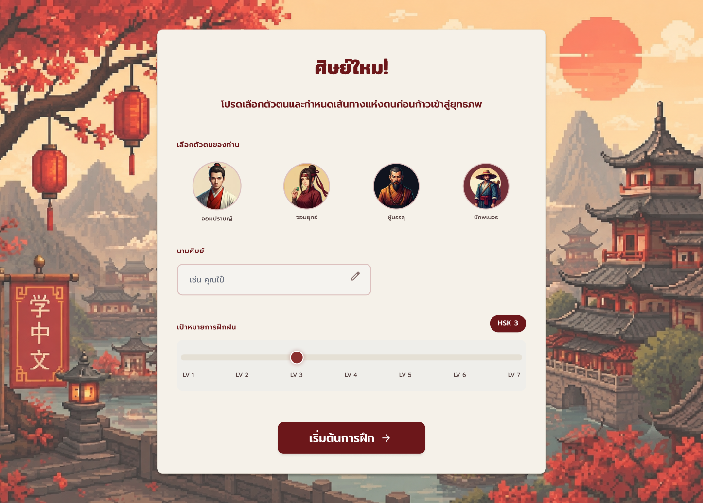
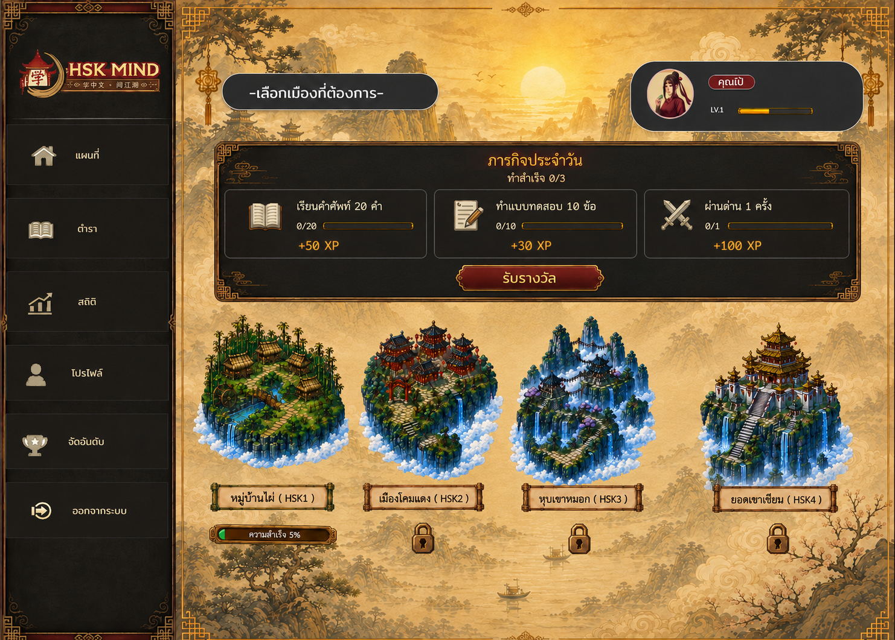
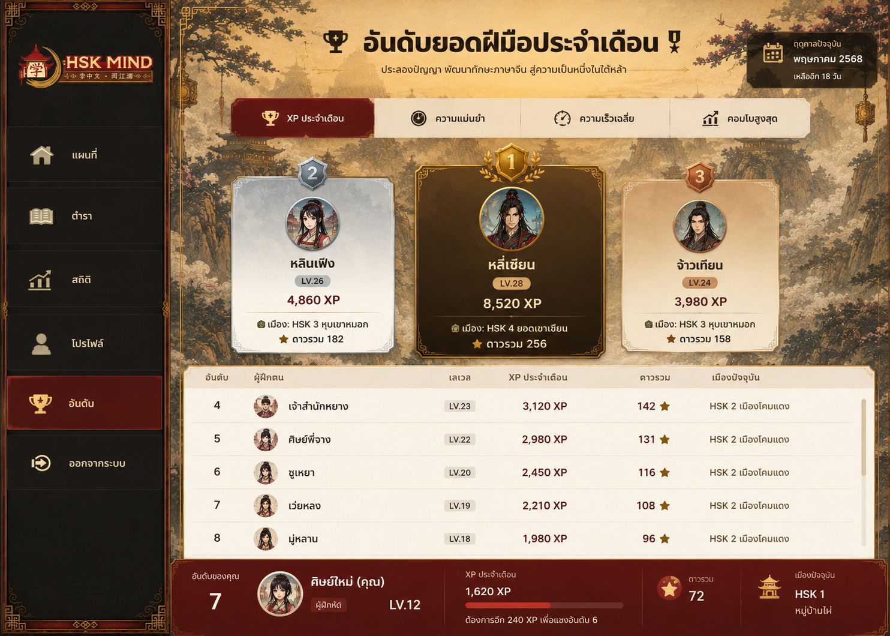

# 0. สรุปสำหรับ Codex ก่อนเริ่มงาน

HSK Mind คือเว็บแอปเรียนคำศัพท์ภาษาจีนแบบเกม (Gamified Chinese Vocabulary Learning Web App) ที่นำเนื้อหา HSK 1–4 มาทำเป็นโลกธีมจีนกำลังภายใน ผู้เล่นเริ่มจากเมือง HSK 1 เรียนคำศัพท์และทำเกมเพื่อสะสม XP, Level, ดาว, สถิติ และปลดล็อกเมืองต่อไป โดยระบบต้องเน้น 3 เรื่องพร้อมกัน คือ **การเรียนจริง**, **Progression แบบเกม**, และ **การแข่งขันกับผู้เล่นคนอื่นแบบรายเดือน**

สิ่งที่ Codex ต้องยึดเป็นหลัก:

- UX/UI ที่ทีมออกแบบไว้เป็น **Source of Truth** ห้ามออกแบบธีมใหม่เอง เว้นแต่เป็น Responsive behavior หรือ state ที่ยังไม่มี mockup
- ระบบ XP, ดาว, Progress, Unlock และ Ranking ต้องคำนวณที่ Backend เท่านั้น ห้ามเชื่อค่าที่ Client ส่งมา
- HSK มีเฉพาะ **HSK 1–4** ในเวอร์ชันนี้
- ในแต่ละเมืองมี 5 บ้าน/โหมด: **Flashcard, Quiz, Matching, Listening, Review**
- Speaking, Writing, PvP แบบ Real-time และ AI Chatbot **ไม่อยู่ใน MVP ปัจจุบัน**
- 1 Stage มีคำศัพท์สูงสุด 20 คำ โดยเรียงตาม Pinyin A–Z และด่านสุดท้ายรับจำนวนเศษได้
- Ranking เป็นรายเดือน แต่ **ไม่ลบหรือรีเซ็ต Total XP, Level, ดาว, Progress หรือสถิติถาวร** ให้สร้างสถิติของแต่ละเดือนแยกจากข้อมูล Lifetime
- ค่าที่เกี่ยวกับ Balance เช่น XP, Timer, Unlock Level, Star threshold ต้องอยู่ใน Config/Database และแก้ได้โดยไม่ต้องเปลี่ยน Core Logic

---

# 1. โปรเจกต์ HSK Mind คืออะไร

## 1.1 แนวคิด

HSK Mind เป็นแพลตฟอร์มฝึกคำศัพท์ภาษาจีนที่เปลี่ยนการเรียน HSK ให้เป็นการเดินทางในโลกจีนแฟนตาซี ผู้ใช้ไม่ได้เห็นเพียงรายการคำศัพท์หรือข้อสอบ แต่จะเห็นแผนที่ 4 เมือง บ้านที่แทนโหมดการฝึก ระบบด่าน ดาว XP Level ฉายา ภารกิจประจำวัน มาสคอตผู้ช่วย และ Ranking กับคนในเซิร์ฟเวอร์

เป้าหมายของระบบคือทำให้ผู้เรียน:

- เรียนคำศัพท์ก่อนผ่าน Flashcard
- ฝึกจำความหมายผ่าน Quiz
- ฝึกการเชื่อมคำจีนกับความหมายผ่าน Matching
- ฝึกการฟังผ่าน Listening
- กลับไปแก้จุดอ่อนผ่าน Review
- เห็นความก้าวหน้าผ่าน XP, Level, ดาว และการปลดล็อกเมือง
- มีแรงจูงใจกลับมาใช้งานผ่าน Daily Mission และ Ranking รายเดือน

## 1.2 กลุ่มผู้ใช้หลัก

ผู้เรียนภาษาจีนระดับเริ่มต้นถึงกลางที่ต้องการฝึกคำศัพท์ตาม HSK 1–4 โดย UI ใช้ภาษาไทยเป็นหลัก และภาษาจีน/Pinyin เป็นเนื้อหาการเรียน

## 1.3 เป้าหมายของ MVP

MVP ถือว่าใช้งานได้เมื่อผู้เล่นสามารถทำ Flow ต่อไปนี้ได้ครบ:

**Register → Onboarding → HSK1 → เลือกบ้าน/โหมด → เลือก Stage → เล่นเกม → Result → ได้ XP/ดาว/สถิติ → คำผิดเข้า Review → Level เพิ่ม → ทำเงื่อนไขเมืองครบ → ปลดล็อกเมืองถัดไป → แข่งขัน Ranking รายเดือน**

---

# 2. ขอบเขตระบบปัจจุบัน

## 2.1 In Scope

- สมัครสมาชิก / Login / Logout / Forgot Password
- Onboarding: เลือกตัวละคร, ตั้งชื่อศิษย์, เลือกเป้าหมาย HSK 1–4
- แผนที่ 4 เมือง
- เมือง HSK 1–4 และระบบ Lock/Unlock
- Flashcard
- Quiz
- Matching
- Listening
- Review
- Vocabulary / ตำรา
- XP / Level / ฉายา
- ดาว / Stage Progress / City Progress
- Wrong Vocabulary
- Daily Mission
- Statistics
- Profile
- Monthly Ranking
- Mascot แบบ Event-based
- Admin สำหรับ User, Vocabulary, Content และ Config

## 2.2 Out of Scope สำหรับ MVP

- Speaking / ตรวจการออกเสียง
- Writing / ตรวจการเขียนตัวจีน
- Real-time PvP
- Chat ระหว่างผู้เล่น
- AI chatbot แบบอิสระ
- HSK 5–6 หรือระดับนอก HSK 1–4
- Shop / ระบบซื้อของด้วยเงินจริง

สิ่งเหล่านี้สามารถต่อใน Phase หลังได้ แต่ Codex ไม่ควรเพิ่มเองระหว่างทำ MVP

---

# 3. โลกของเกมและโครงสร้างเมือง

มี 4 เมืองตามลำดับ:

1. **หมู่บ้านไผ่ — HSK 1**: เปิดให้ผู้เล่นใหม่ทันที
2. **เมืองโคมแดง — HSK 2**: ล็อกตอนเริ่มต้น
3. **หุบเขาหมอก — HSK 3**: ล็อกตอนเริ่มต้น
4. **ยอดเขาเซียน — HSK 4**: ล็อกตอนเริ่มต้น

ผู้เล่นใหม่ต้องเริ่มจาก HSK 1 ไม่ว่าตอน Onboarding จะเลือกเป้าหมายเป็น HSK ใดก็ตาม ค่า “เป้าหมาย HSK” เป็นเป้าหมายส่วนตัว ไม่ใช่ระดับเริ่มต้นและไม่ใช่เงื่อนไข Skip เมือง

## 3.1 บ้านในแต่ละเมือง

เมื่อเข้าเมือง จะเห็นบ้าน 5 หลัง โดยบ้านแต่ละหลังแทนโหมด:

1. Flashcard
2. Quiz
3. Matching
4. Listening
5. Review

Flashcard, Quiz, Matching และ Listening มี Stage ตามชุดคำศัพท์ของเมือง ส่วน Review ไม่มี Stage ตายตัว

---

# 4. คำศัพท์และการสร้าง Stage

## 4.1 แหล่งคำศัพท์

คำศัพท์ทั้งหมดมาจากหน้า Vocabulary/ตำรา แยก HSK 1–4

ข้อมูลคำศัพท์ขั้นต่ำ:

- Hanzi / คำจีน
- Pinyin
- Pinyin sort key
- คำแปลภาษาไทย
- HSK Level
- Audio URL หรือ Audio Asset
- Active status

## 4.2 การเรียง Stage

คำศัพท์ในแต่ละ HSK ต้องเรียงตาม **Pinyin A–Z** แล้วแบ่งเป็นชุดละสูงสุด 20 คำ

สูตร:

`จำนวน Stage = ceil(จำนวนคำศัพท์ของ HSK / 20)`

ตัวอย่าง: 167 คำ = 8 ด่านเต็ม + ด่านสุดท้าย 7 คำ = 9 Stage

จำนวน Stage ของแต่ละ HSK **ห้าม Fix** เพราะจำนวนคำศัพท์แต่ละ HSK ไม่เท่ากัน

## 4.3 ข้อกำหนดสำคัญเรื่อง Stage Mapping

หลังระบบขึ้น Production แล้ว ห้ามเรียงและย้ายคำศัพท์ข้าม Stage อัตโนมัติทุกครั้งที่มีการเพิ่มคำใหม่ เพราะจะทำให้ Progress เดิมของผู้เล่นผิดตำแหน่ง

ให้เก็บ `StageVocabulary` แบบ Persistent:

- ตอน Seed/Import ครั้งแรก ให้เรียง Pinyin A–Z และสร้าง Stage
- หลังเปิดใช้งานจริง ถ้าเพิ่มคำศัพท์ ให้ Admin เป็นผู้สั่ง Rebuild แบบ Controlled Migration หรือ Append ตามกติกาที่กำหนด
- ห้ามทำ Dynamic Stage grouping จาก query ทุกครั้งที่เปิดเกม

## 4.4 คำศัพท์ชุดเดียวกันในหลายโหมด

Stage เดียวกันต้องใช้คำศัพท์ชุดเดียวกันใน Flashcard, Quiz, Matching และ Listening เพื่อให้ Flow การเรียนสอดคล้องกัน

---

# 5. Flashcard

## 5.1 จุดประสงค์

เป็นโหมดเรียนรู้คำศัพท์ก่อนทำเกมที่ให้คะแนน

## 5.2 พฤติกรรม

แต่ละ Stage แสดงคำศัพท์สูงสุด 20 คำ ผู้เล่นสามารถดู:

- Hanzi
- Pinyin
- ความหมายไทย
- เสียงอ่าน

ในหน้า Vocabulary/ตำราและ Flashcard **ไม่ต้องมีไอคอนลำโพง** ให้คลิก/แตะที่กรอบคำศัพท์ทั้งใบเพื่อเล่นเสียง และต้องมี Hover/Pressed state เพื่อสื่อว่าการ์ดกดได้

## 5.3 XP / ดาว / Ranking

- XP: 0
- ดาว: ไม่มี
- Monthly Ranking XP: ไม่นับ
- Stage Completion: ถือว่าเสร็จเมื่อผู้เล่นเปิดดูคำศัพท์ครบทุกคำใน Stage อย่างน้อย 1 ครั้ง
- Stage นี้นับในเงื่อนไข 70% Completion ของเมือง

---

# 6. Quiz

## 6.1 รูปแบบ

- แสดงคำศัพท์จีน 1 คำ
- มี 4 ตัวเลือกความหมายภาษาไทย
- มี Timer นับถอยหลัง
- Default Timer: **15 วินาที/ข้อ** (Configurable)

Distractor ต้องเป็นคำตอบที่ไม่ซ้ำกัน ควรดึงจาก Stage เดียวกันก่อน หากด่านสุดท้ายมี candidate ไม่พอให้ดึงจาก HSK เดียวกัน

## 6.2 เมื่อผู้เล่นตอบ

ตอบถูก:

- ได้ Base XP หากคำนี้ยังไม่เคย Claim XP ใน Quiz Stage นี้
- Combo เพิ่ม
- บันทึก Correct และ Response Time

ตอบผิด:

- 0 Base XP ของคำนี้ในรอบนั้น
- Combo Reset
- บันทึก Wrong Vocabulary
- แสดงเฉลย

หมดเวลา:

- ถือว่าตอบผิดทันที
- 0 XP ของคำนี้
- Combo Reset
- บันทึกเป็น Wrong Vocabulary
- แสดงเฉลยเหมือนตอบผิดปกติ

## 6.3 Base XP

ตอบถูกและยังไม่เคยได้ XP ของคำนี้ใน Quiz:

**+10 XP / คำ**

Stage 20 คำจึงมี Base XP สูงสุด 200 XP ก่อน Combo

Backend ต้องจำระดับ `User + Vocabulary + Mode` ว่าเคย Claim Base XP แล้วหรือไม่ เพื่อป้องกันการฟาร์ม

## 6.4 Combo Bonus

ค่าเริ่มต้น:

- Combo x5 → +5 XP
- Combo x10 → +10 XP
- Combo x15 → +15 XP
- Combo x20 → +20 XP

รวมโบนัสสูงสุด Stage 20 ข้อ = 50 XP

Combo Bonus ต้อง Claim แบบ “ส่วนต่างจาก Best เดิม” ไม่ใช่แจกซ้ำทุกครั้ง

ตัวอย่าง: เคยถึง x10 และรับโบนัสรวม 15 XP แล้ว รอบใหม่ถึง x20 ให้เพิ่มอีก 35 XP เท่านั้น

## 6.5 ดาว Quiz

คิดจาก Accuracy:

- 3 ดาว: 90–100%
- 2 ดาว: 75–89%
- 1 ดาว: 60–74%
- 0 ดาว: ต่ำกว่า 60%

ใช้เปอร์เซ็นต์จึงรองรับด่านสุดท้ายที่มีคำไม่ครบ 20

Best Stars ห้ามลดลงเมื่อเล่นรอบใหม่แย่กว่าเดิม

## 6.6 การเล่นซ้ำ

ผู้เล่นเล่น Stage เดิมซ้ำได้เพื่อ:

- แก้คำศัพท์ที่เคยตอบผิด
- Claim +10 XP ของคำที่ยังไม่เคยได้ Base XP
- ทำดาวให้ดีขึ้น
- ทำ Best Combo ให้ดีขึ้นและ Claim เฉพาะ Combo Bonus ส่วนต่าง
- ปรับ Best Accuracy

คำที่เคยตอบถูกและ Claim +10 XP ไปแล้วจะไม่ให้ Base XP ซ้ำ

## 6.7 Result Screen

ต้องแสดงอย่างน้อย:

- Accuracy (%)
- ตอบถูกกี่ข้อ / ทั้งหมด
- ตอบผิดกี่ข้อ
- Best Combo ของรอบ
- XP ที่ได้รับ “รอบนี้”
- ดาวรอบนี้และ Best Stars
- รายการคำศัพท์ที่ตอบผิด
- ปุ่มเล่นใหม่ / ไป Review / กลับ Stage/เมือง

---

# 7. Listening

## 7.1 รูปแบบ

- ระบบเล่นเสียงคำศัพท์จีนอัตโนมัติ 1 ครั้ง
- ผู้เล่นเลือกคำศัพท์จีนที่ตรงกับเสียงจาก 4 ตัวเลือก
- กด “ฟังซ้ำ” ได้เพิ่ม **1 ครั้งต่อข้อเท่านั้น**
- รวมฟังได้สูงสุด 2 รอบต่อข้อ
- Default Timer: 15 วินาที/ข้อ

Timer เริ่มหลังเสียงรอบแรกจบ หากผู้เล่นกดฟังซ้ำ Timer **ไม่ Reset** และยังเดินต่อ

## 7.2 เมื่อผิดหรือหมดเวลา

เหมือน Quiz:

- ถือว่าผิด
- 0 XP ของคำนั้น
- บันทึก Wrong Vocabulary
- แสดงเฉลย

## 7.3 XP

- ตอบถูกครั้งที่ยังไม่เคย Claim ใน Listening: +10 XP/คำ
- คำที่เคยได้ XP แล้วไม่ให้ซ้ำ
- คำที่เคยผิดแล้วกลับมาแก้ถูกภายหลัง: สามารถ Claim +10 XP ได้

Listening **ไม่มี Combo** เพื่อให้ Quiz มีเอกลักษณ์เฉพาะตัว

## 7.4 ดาว Listening

- 3 ดาว: 90–100%
- 2 ดาว: 75–89%
- 1 ดาว: 60–74%
- 0 ดาว: ต่ำกว่า 60%

Best Stars ห้ามลด

## 7.5 Result Screen

แสดง:

- Accuracy
- Correct / Wrong
- XP รอบนี้
- ดาวรอบนี้ / Best Stars
- คำศัพท์ที่ตอบผิด
- จำนวนครั้งที่ใช้ Replay (optional statistic)

---

# 8. Matching

## 8.1 รูปแบบ

จับคู่คำศัพท์จีนกับคำแปลภาษาไทยให้ครบ โดยมีการจับเวลา

ยิ่งทำเร็ว ยิ่งได้ XP มาก ผู้เล่นที่ทำช้าก็ยังได้ XP ต่ำกว่า

## 8.2 เกณฑ์ดาวแบบ Seconds per Item

ห้ามใช้เวลาตายตัวต่อ Stage เพราะด่านสุดท้ายอาจมีคำไม่ครบ 20 ให้ใช้ค่าเฉลี่ยวินาทีต่อคู่:

- 3 ดาว: ≤ 3.0 วินาที/คู่
- 2 ดาว: ≤ 4.5 วินาที/คู่
- 1 ดาว: ≤ 6.0 วินาที/คู่
- 0 ดาว: > 6.0 วินาที/คู่

ตัวอย่าง Stage 20 คู่: 3 ดาว ≤60s, 2 ดาว ≤90s, 1 ดาว ≤120s

## 8.3 XP Matching

ค่าฐานสำหรับ Stage 20 คำ:

- 3 ดาว = 200 XP
- 2 ดาว = 150 XP
- 1 ดาว = 100 XP
- 0 ดาว = 50 XP

หาก Stage มีคำไม่ครบ 20 ให้ Scale ตามจำนวนคำ:

`xp = round(tierXpFor20 * itemCount / 20)`

## 8.4 การเล่นซ้ำ

Matching ให้ XP เพิ่มเฉพาะเมื่อผู้เล่นปรับ Reward Tier/ดาวดีขึ้น

ตัวอย่าง:

- ครั้งแรก 1 ดาว → Claim 100 XP
- ครั้งใหม่ 2 ดาว → เพิ่ม +50 XP
- ครั้งใหม่ 3 ดาว → เพิ่ม +50 XP
- ถ้าดาวเท่าเดิมแต่เวลาเร็วขึ้น → อัปเดต Best Time แต่ 0 XP เพิ่ม

Best Stars และ Best Time ต้องเก็บถาวร

## 8.5 Result Screen

แสดง:

- เวลารวม
- Seconds per Item
- ดาว
- XP รอบนี้
- Best Time
- คำศัพท์/คู่ที่ผู้เล่นจับผิดบ่อยในรอบหรือใน Stage

---

# 9. Review

## 9.1 จุดประสงค์

รวมคำศัพท์ที่ผู้เล่นตอบ/จับคู่ผิดจาก 3 โหมด:

- Quiz
- Matching
- Listening

Review **ไม่มี Stage** และไม่ใช้โครง Stage ของเมือง

## 9.2 การจัดรายการ

หน้า Review ควรมี:

- All
- Quiz
- Matching
- Listening

คำศัพท์เดียวกันอาจผิดจากหลายโหมด แต่ UI สามารถรวมเป็น 1 รายการและบอก Source Mode ได้

## 9.3 XP Review

- แก้คำผิดสำเร็จ: +2 XP / คำ
- เคลียร์รายการที่ Pending ทั้งหมดใน Review session: +10 XP Bonus
- XP นี้เข้า Total XP และ Level
- XP นี้ **ไม่เข้า Monthly XP Ranking**

Anti-farm:

- คำเดียวกันรับ Review XP ได้สูงสุด 1 ครั้ง/วัน
- ต้องเป็นคำที่อยู่ใน Review Queue ก่อนเริ่ม Review session

## 9.4 การล้างคำผิด

เมื่อแก้คำได้สำเร็จ ให้ `needsReview = false` เพื่อไม่โชว์เป็นคำที่ต้องทบทวนแล้ว แต่เก็บ `wrongCountTotal` ไว้เป็น Historical Analytics ได้

ดังนั้นหน้า “คำที่ผิดบ่อย” สามารถมีทั้งมุมมอง Active Problems และ Lifetime Mistakes

---

# 10. XP, Level และฉายา

## 10.1 Level

Level สูงสุดที่ใช้กับฉายา = 40

- Lv. 1–10: 🥋 ผู้ฝึกหัด
- Lv. 11–20: ⚔️ จอมยุทธ์ฝึกหัด
- Lv. 21–30: 🐉 จอมยุทธ์
- Lv. 31–40: ☁️ เซียนยุทธ์

เมื่อ Lv.40 แล้ว ผู้เล่นยังรับ Total XP และ Monthly XP ได้ต่อ แต่ Level คงที่ Lv.40 เพื่อให้ Ranking ยังเล่นได้

## 10.2 XP ที่ต้องใช้ต่อ Level

สูตรค่าเริ่มต้น:

`xpNeededForNextLevel(level) = 200 + (level - 1) * 25`

ตัวอย่าง:

- Lv1→2 = 200 XP
- Lv2→3 = 225 XP
- Lv10→11 = 425 XP
- Lv20→21 = 675 XP
- Lv30→31 = 925 XP
- Lv39→40 = 1,150 XP

XP สะสมโดยประมาณ:

- ถึง Lv8 = 1,925 XP
- ถึง Lv11 = 3,125 XP
- ถึง Lv18 = 6,800 XP
- ถึง Lv21 = 8,750 XP
- ถึง Lv28 = 14,175 XP
- ถึง Lv31 = 16,875 XP
- ถึง Lv40 = 26,325 XP

Backend ควรมี `XpTransaction` เป็น Ledger และอัปเดต `UserProfile.totalXp` + `level` แบบ Transactional

---

# 11. เงื่อนไขปลดล็อกเมือง

## 11.1 Level Gate ค่าเริ่มต้น

เก็บค่าเหล่านี้ใน Config/Database ไม่ Hard-code:

- HSK1: Lv1
- HSK2: Lv8
- HSK3: Lv18
- HSK4: Lv28

ค่าดังกล่าวเป็น Initial Balance และต้องปรับได้หลัง Playtest

## 11.2 Completion Gate

ก่อนปลดล็อกเมืองถัดไป ผู้เล่นต้องเล่นครบอย่างน้อย **70% แยกในแต่ละโหมดที่มี Stage**:

- Flashcard ≥70%
- Quiz ≥70%
- Matching ≥70%
- Listening ≥70%

Review ไม่นับ เพราะไม่มี Stage

สูตรต่อโหมด:

`completionRate = completedStages / totalStages`

คำว่า Completed หมายถึงผู้เล่นจบรอบ Stage นั้นแล้ว แม้ดาวจะเป็น 0 เพราะมี Star Gate แยกต่างหาก

## 11.3 Star Gate

นับเฉพาะ:

- Quiz
- Matching
- Listening

Flashcard และ Review ไม่มีดาว

`maxCityStars = totalStages * 3 modes * 3 stars`

`cityStarRate = earnedBestStars / maxCityStars`

ต้อง ≥70%

ใช้ Best Stars ของแต่ละ Stage เท่านั้น ไม่รวมดาวซ้ำจากการเล่นหลายรอบ

## 11.4 Unlock Final Condition

ปลดล็อกเมืองถัดไปเมื่อครบทั้ง 3 กลุ่ม:

1. Level ถึงเกณฑ์
2. Flashcard/Quiz/Matching/Listening แต่ละโหมด Completion ≥70%
3. City Star Rate ≥70%

เมื่อปลดล็อกแล้วต้องบันทึก `unlockedAt` และ **ห้าม Lock กลับ** แม้ Admin จะปรับ Config ในภายหลัง

---

# 12. Daily Mission

Main Page ต้องมี Daily Mission เพื่อสร้างเหตุผลให้กลับมาเล่นทุกวัน ตำแหน่ง UI ให้ยึด mockup ล่าสุดของทีม

## 12.1 MVP Mission Pool แนะนำ

สร้าง 3 ภารกิจ/วัน เช่น:

- เรียนคำศัพท์ 20 คำผ่าน Flashcard
- ตอบ Quiz/Listening ให้ครบ 10 ข้อ
- เล่น Stage แบบมีคะแนนให้จบ 1 Stage

Reward ให้เก็บใน Database/Config ไม่ Hard-code ตัวเลขใน UI

ค่า Seed แนะนำสำหรับ Playtest:

- Mission 1: +20 XP
- Mission 2: +30 XP
- Mission 3: +50 XP
- ทำครบ 3 ภารกิจ: +50 XP Bonus

Daily Mission XP:

- เข้า Total XP / Level
- เข้า Monthly XP Ranking
- Claim ได้ครั้งเดียวต่อ Mission ต่อวัน

Timezone ของการเปลี่ยนวันสำหรับผู้ใช้ไทย: **Asia/Bangkok** แต่ Database เก็บ timestamp เป็น UTC

---

# 13. Vocabulary / ตำรา

หน้า Vocabulary เป็นรายการคำศัพท์ตาม HSK

ต้องรองรับ:

- Filter HSK 1–4
- Search Hanzi / Pinyin / คำแปลไทย
- เรียงตาม Pinyin A–Z
- แสดง Hanzi, Pinyin, คำแปล
- กดกรอบคำศัพท์ทั้งใบเพื่อเล่นเสียง
- ไม่มีไอคอนลำโพง
- Hover/Pressed state
- อาจแสดงสถานะ Learned / Needs Review ในอนาคต

Audio ควรใช้ `audioUrl` ที่ Cache/เก็บเป็นไฟล์ ไม่เรียก TTS ใหม่ทุกครั้งที่ผู้เล่นคลิก

MVP สามารถใช้ไฟล์เสียงที่เตรียมไว้ใน `/public/audio` หรือ Object Storage; ภายหลังค่อยสร้าง Service สำหรับ Generate TTS และ Cache

---

# 14. Statistics

หน้า Statistics ควรแสดงทั้ง Lifetime และแยก HSK:

- Level / Total XP
- ฉายา
- HSK เป้าหมาย
- เมืองสูงสุดที่ปลดล็อก
- จำนวนคำศัพท์ที่เรียนแล้ว
- Completion ของแต่ละโหมด
- ดาวรวม / ดาวเต็ม
- Quiz Accuracy
- Listening Accuracy
- Average Speed
- Best Matching Time
- Best Quiz Combo
- จำนวนคำที่ Needs Review
- Top Wrong Vocabulary
- จำนวน Stage ที่เล่นทั้งหมด

อย่าผสม Monthly Ranking Stats กับ Lifetime Stats โดยไม่มี Label ชัดเจน

---

# 15. Monthly Ranking

## 15.1 แนวคิดสำคัญ

Ranking เป็น “ฤดูกาลรายเดือน” แต่ **ห้าม Reset ข้อมูลถาวร**

ไม่ Reset:

- Total XP
- Level
- Best Stars
- Progress
- Best Time Lifetime
- Best Combo Lifetime
- City Unlock
- Achievement

เมื่อขึ้นเดือนใหม่ ให้สร้าง Monthly Season ใหม่ เช่น `2026-08`, `2026-09` และเริ่ม aggregate ของเดือนใหม่จาก 0 โดยเก็บข้อมูลเดือนเก่าไว้ดูย้อนหลังได้

## 15.2 Tab Ranking

หน้า Ranking มี 4 หมวด:

1. 🏆 XP ประจำเดือน
2. 🎯 ความแม่นยำ
3. ⚡ ความเร็วเฉลี่ย
4. 🔥 Combo สูงสุด

Default Tab = XP ประจำเดือน

## 15.3 Monthly XP Ranking

`monthlyXp = SUM(XpTransaction.amount WHERE rankEligible=true AND createdAt in season)`

Rank Eligible Sources:

- Quiz
- Matching
- Listening
- Daily Mission

Not Rank Eligible:

- Flashcard (ไม่มี XP)
- Review XP

Total XP ยังเพิ่มตามปกติ แต่ Ranking ใช้เฉพาะ XP ที่เกิดในเดือนนั้น

Tie-break:

1. Monthly XP มากกว่า
2. Monthly Accuracy มากกว่า
3. Average Speed ต่ำกว่า
4. หากยังเท่ากัน ใช้เวลาที่ทำคะแนนถึงค่านั้นก่อน

## 15.4 Monthly Accuracy Ranking

ใช้ Quiz + Listening:

`accuracy = correctAnswers / totalAnswers * 100`

- Timeout = Wrong
- ต้องมีอย่างน้อย 100 Answers ในเดือนนั้นจึงมีสิทธิ์ติด Ranking

Tie-break: จำนวน Answers มากกว่า → Monthly XP มากกว่า

## 15.5 Monthly Average Speed Ranking

ผู้ใช้ต้องการสถิติเวลาเฉลี่ยจากเกมที่จับเวลาทั้งหมด ให้ normalize เป็น **Effective Seconds per Item**

Quiz:

- Correct → เวลาตอบจริง
- Wrong → ใช้ค่า Max Timer เช่น 15s
- Timeout → 15s

Listening:

- Correct → เวลาตอบจริง
- Wrong/Timeout → 15s
- การกด Replay ไม่ Reset timer

Matching:

- ใช้ `totalStageTime / itemCount`
- การจับผิดทำให้เวลารวมสูงขึ้นเอง

รวม Ranking:

`avgEffectiveSeconds = totalEffectiveTime / totalTimedItems`

ยิ่งต่ำยิ่งอันดับสูง

Qualification:

- อย่างน้อย 100 Timed Items/เดือน
- Monthly Accuracy จาก Quiz+Listening ≥70%

เงื่อนไขนี้ช่วยกันการกดมั่วเร็ว ๆ เพื่อโกงค่าเฉลี่ย

## 15.6 Monthly Combo Ranking

ใช้ Best Quiz Combo ที่ทำได้ในเดือนนั้น

Tie-break:

1. Combo สูงกว่า
2. Accuracy ของ Attempt นั้นสูงกว่า
3. เวลา Attempt สั้นกว่า

## 15.7 ข้อมูล Lifetime ที่แสดงใน Row

แม้ Ranking เป็นรายเดือน ให้โชว์ข้อมูลประกอบได้:

- Avatar
- Display Name
- Level
- ฉายา
- Total Stars
- เมืองสูงสุดที่ปลดล็อก

แต่ข้อมูลเหล่านี้ไม่ถูก Reset และไม่ใช่ Primary Score ของ Monthly XP Tab

## 15.8 UI Ranking

- Top 3 เป็น Podium เด่น
- อันดับ 4 ลงไปเป็น Table/List
- ด้านล่าง Sticky แสดง “อันดับของคุณ” แม้ไม่ติด Top list
- แสดงคะแนนที่ต้องเพิ่มเพื่อแซงอันดับเหนือผู้ใช้ เช่น “อีก 240 XP จะแซงอันดับ 6”
- แสดงเดือนปัจจุบันและจำนวนวันที่เหลือ

## 15.9 Reward ปลายเดือน

MVP สามารถยังไม่แจก Reward หรือแจกเฉพาะ Cosmetic/Badge/Title

ไม่แนะนำแจก XP ก้อนใหญ่ตามอันดับ เพราะจะทำให้ผู้เล่นที่นำอยู่ได้เปรียบสะสมมากขึ้น

---

# 16. Mascot / ผู้ช่วยในเกม

## 16.1 MVP ไม่ใช้ AI ก่อน

ทำ Mascot แบบ Event-based เพื่อควบคุมคำแนะนำและไม่เพิ่มค่า API

Event ตัวอย่าง:

- FIRST_LOGIN
- STAGE_START
- STAGE_COMPLETE
- WRONG_STREAK
- TIMEOUT
- COMBO_5 / 10 / 15 / 20
- STAR_IMPROVED
- LEVEL_UP
- CITY_NEAR_UNLOCK
- CITY_UNLOCKED
- REVIEW_HAS_ITEMS
- REVIEW_CLEARED
- DAILY_MISSION_NEAR_COMPLETE
- DAILY_MISSION_COMPLETE
- RANK_NEAR_OVERTAKE

ตัวอย่างข้อความ:

- “อีกเพียง 6 ดาว เมืองโคมแดงก็จะเปิดแล้ว!”
- “ช่วงนี้เจ้าสับสนคำกลุ่มนี้บ่อย ลองเข้าโหมดทบทวนดูไหม?”
- “Combo x10! รักษาจังหวะไว้!”
- “อีก 85 XP เจ้าจะแซงอันดับ 12 แล้ว!”

## 16.2 Phase หลัง

สามารถเพิ่ม AI เพื่อ:

- อธิบายคำศัพท์
- เสนอ Mnemonic
- สร้างประโยคตัวอย่าง
- วิเคราะห์คำที่ผิดบ่อย

AI **ห้าม** เป็นผู้ตัดสิน XP, ดาว, Unlock หรือ Ranking

---

# 17. Profile และ Onboarding

## 17.1 Register

- Email
- Password ขั้นต่ำ 8 ตัวอักษร
- Confirm Password
- Eye toggle ทั้ง Password และ Confirm Password
- Validation state
- Email ซ้ำ
- Password ไม่ตรง
- Loading state
- Login link

## 17.2 Onboarding หลัง Register

Flow:

**Register Success → เลือก Avatar → ตั้งชื่อศิษย์ → เลือกเป้าหมาย HSK 1–4 → เริ่มต้นการฝึก → Main Map**

ต้องมี Selected state ของ Avatar ชัดเจน

คำว่า “เป้าหมายการฝึก” ใช้ HSK 1–4 ไม่ใช้ LV 1–7

## 17.3 Profile

- Avatar
- Display Name
- Email
- Level
- Title
- Total XP
- Target HSK
- Highest Unlocked City
- Achievement (ถ้ามี)
- เปลี่ยน Avatar / ชื่อ / Password
- Logout

---

# 18. Admin

Admin ไม่จำเป็นต้องใช้ธีมเกมเต็มเท่าหน้าผู้เล่น แต่ต้องใช้ Design System เดียวกัน

MVP Admin:

## User Management

- Search User
- View Profile/Level/Progress
- Suspend/Activate User
- ดู XpTransaction เบื้องต้นสำหรับ Debug

## Vocabulary Management

- CRUD Vocabulary
- Import CSV/JSON
- HSK Level
- Hanzi
- Pinyin
- Pinyin sort key
- Thai meaning
- Audio URL
- Active status

## Stage Management

- Preview Stage mapping
- Generate Stage จากชุดคำศัพท์
- Controlled Rebuild ก่อน Production/ผ่าน Migration
- ห้าม regenerate อัตโนมัติจน Progress ผู้เล่นพัง

## Game Balance Config

แก้ค่า:

- Stage size (default 20; เปลี่ยนหลัง Production ต้องระวัง)
- Unlock Level
- Completion threshold
- Star threshold
- Timer
- XP values
- Matching time tiers
- Review reward
- Daily Mission reward

## Daily Mission

- Mission definitions
- Active/inactive
- Reward

## Monitoring

- Active users
- Attempts/day
- XP/day
- Error logs เบื้องต้น

---

# 19. UX/UI Requirements

## 19.1 Source of Truth

ไฟล์ UX/UI ที่ทีมส่งให้ Codex ต้องถือเป็น Source of Truth ในเรื่อง:

- Layout
- Theme
- Chinese fantasy art direction
- Colors
- Typography
- Borders / cards / decorative assets
- Sidebar/navigation
- Character/avatar style

Codex ห้ามเปลี่ยนหน้าตาเป็น Dashboard สมัยใหม่ทั่วไปหรือใช้ Component Library ที่ทำให้ธีมสูญหาย

## 19.2 States ที่ต้องมีแม้ Mockup ยังไม่ครบ

ทุกหน้าที่ Interactive ต้องมี:

- Default
- Hover
- Active/Selected
- Disabled/Locked
- Loading
- Empty
- Error
- Success

## 19.3 Responsive

Desktop เป็น Source of Truth จาก mockup ปัจจุบัน

สำหรับ Tablet/Mobile:

- รักษา theme และ information hierarchy
- Sidebar สามารถยุบเป็น Drawer/compact navigation
- Ranking table เปลี่ยนเป็น card/list ได้
- Map/City asset ห้ามบีบจนผิดสัดส่วน
- Game interaction ต้องกดง่ายด้วย touch

หากยังไม่มี Mobile UX asset ให้ Codexทำ responsive engineering fallback แต่ไม่ redesign visual language

---

# 20. Framework และ Technology Stack ที่แนะนำ

## 20.1 หลักการเลือก

ต้องการ Stack ที่:

- Frontend/Backend ใช้ TypeScript ชุดเดียวกัน
- แยก Game Business Logic ชัด
- รองรับ Auth, Admin, Ranking, Progress และ REST API
- Test ได้ง่าย
- Codex อ่านโครงสร้างและพัฒนาต่อได้ง่าย
- ไม่เพิ่มระบบกระจายตัวเกินความจำเป็นใน MVP

## 20.2 Frontend

**Next.js (App Router) + TypeScript**

ใช้สำหรับ:

- Routing / Layout
- React UI
- Server/Client Components ตามความเหมาะสม
- Auth pages, Game UI, Ranking, Stats, Admin UI

ใช้ **Tailwind CSS** สำหรับ Layout/Spacing/Responsive และใช้ Custom CSS/CSS variables สำหรับธีมจีน, texture, border, pixel art และองค์ประกอบเฉพาะ

ใช้ **TanStack Query** สำหรับ Server State เช่น profile, progress, stage data, ranking และ mutation หลังจบเกม

Game state ชั่วคราวในหน้า เช่น current question, selected answer, countdown สามารถใช้ React state/useReducer ก่อน หากซับซ้อนค่อยใช้ lightweight store; ไม่ต้องเพิ่ม global state libraryโดยไม่มีเหตุผล

## 20.3 Backend

**NestJS + TypeScript + REST API**

เหตุผลคือระบบมี Business Rules จำนวนมาก เช่น XP claim, Replay, Unlock, Monthly Ranking, Daily Mission และ Admin; แยก Backend เป็น module จะควบคุม logic และ test ง่ายกว่าใส่ทุกอย่างใน Frontend

Modules แนะนำ:

- AuthModule
- UsersModule
- ProfileModule
- VocabularyModule
- StagesModule
- GameModule
- ProgressModule
- XpModule
- ReviewModule
- MissionsModule
- LeaderboardModule
- MascotModule
- AdminModule
- ConfigModule

เปิด **Swagger/OpenAPI** ใน Development เพื่อให้ Frontend/Codex ตรวจ endpoint ได้ง่าย

## 20.4 Database

**PostgreSQL + Prisma ORM**

PostgreSQL เหมาะกับข้อมูลสัมพันธ์จำนวนมาก เช่น User ↔ Stage ↔ Vocabulary ↔ Attempt ↔ XP transaction และ Monthly Stats

Prisma ใช้สำหรับ Schema, Migration และ Type-safe database access

## 20.5 Authentication

- Email + Password
- Password Hash: Argon2
- Access/Refresh token หรือ secure session โดยเก็บ token ใน HttpOnly/Secure/SameSite cookie
- Role: USER / ADMIN
- Forgot Password ใช้ reset token ที่มี expiry
- Rate-limit endpoint Login/Register/Forgot Password

## 20.6 Testing

- Unit test: Game formulas, XP, star, unlock, monthly calculations
- Backend integration: Jest/Supertest หรือชุดทดสอบของ NestJS
- E2E: Playwright
- Database test: isolated test database

## 20.7 Local Development

- Package manager: pnpm
- Monorepo: pnpm workspaces
- Docker Compose: PostgreSQL local
- `.env.example` ต้องมีและห้าม commit secret
- Redis **ไม่ต้องใช้ใน MVP**; เพิ่มทีหลังหาก Leaderboard มีโหลดสูงจริง

## 20.8 Production แนวทาง

- Frontend deploy บน platform ที่รองรับ Next.js
- Backend เป็น Node container/service
- Managed PostgreSQL
- Audio/Assets ใช้ CDN/Object Storage เมื่อ Production
- เก็บ timestamp เป็น UTC แต่ Daily/Monthly boundary คำนวณด้วย Asia/Bangkok

## 20.9 Technical References

- Next.js App Router: https://nextjs.org/docs/app
- NestJS: https://docs.nestjs.com/first-steps
- NestJS OpenAPI: https://docs.nestjs.com/openapi/introduction
- Prisma ORM: https://www.prisma.io/docs/orm
- Tailwind CSS: https://tailwindcss.com/docs/installation/framework-guides
- TanStack Query: https://tanstack.com/query/latest/docs/framework/react
- Playwright: https://playwright.dev/docs/intro

ใช้ Current Stable versions ที่เข้ากันได้ ณ วันที่เริ่ม Implementation และ Pin version ใน lockfile; ห้ามใช้ Canary/Early Access โดยไม่จำเป็น

---

# 21. โครงสร้าง Repository แนะนำ

```text
hsk-mind/
├─ apps/
│  ├─ web/                     # Next.js
│  │  ├─ app/
│  │  ├─ components/
│  │  ├─ features/
│  │  ├─ lib/
│  │  ├─ public/
│  │  └─ styles/
│  └─ api/                     # NestJS
│     ├─ src/
│     │  ├─ auth/
│     │  ├─ users/
│     │  ├─ vocabulary/
│     │  ├─ stages/
│     │  ├─ game/
│     │  ├─ progress/
│     │  ├─ xp/
│     │  ├─ review/
│     │  ├─ missions/
│     │  ├─ leaderboard/
│     │  ├─ mascot/
│     │  └─ admin/
│     └─ test/
├─ packages/
│  ├─ shared-types/
│  ├─ game-config/
│  └─ shared-utils/
├─ prisma/
│  ├─ schema.prisma
│  ├─ migrations/
│  └─ seed.ts
├─ docs/
│  ├─ product-spec/
│  └─ design-reference/
├─ docker-compose.yml
├─ pnpm-workspace.yaml
├─ .env.example
└─ README.md
```

ไม่จำเป็นต้องใช้ Turborepo ใน MVP หาก pnpm workspaces เพียงพอ

---

# 22. Database Model ระดับ Implementation

ชื่อตารางสามารถปรับได้ แต่ความหมายต้องครบ

## 22.1 User

- id UUID
- email unique
- passwordHash
- role USER/ADMIN
- status ACTIVE/SUSPENDED
- createdAt
- updatedAt

## 22.2 UserProfile

- userId PK/FK
- displayName
- avatarKey
- targetHsk 1–4
- level
- totalXp
- title (หรือ derive จาก level)
- createdAt / updatedAt

## 22.3 HskLevel

- id 1–4
- code HSK1…HSK4
- thaiName
- unlockLevel
- order
- active

## 22.4 Vocabulary

- id
- hskLevelId
- hanzi
- pinyin
- pinyinSortKey
- thaiMeaning
- audioUrl
- active
- createdAt / updatedAt

Indexes: `(hskLevelId, pinyinSortKey)`

## 22.5 Stage

- id
- hskLevelId
- stageNo
- active
- createdAt

Unique: `(hskLevelId, stageNo)`

## 22.6 StageVocabulary

- stageId
- vocabularyId
- orderNo

Unique: `(stageId, vocabularyId)` และ `(stageId, orderNo)`

## 22.7 UserStageProgress

หนึ่ง Row ต่อ `user + stage + mode`

- userId
- stageId
- mode FLASHCARD/QUIZ/MATCHING/LISTENING
- completed
- completedAt
- attemptsCount
- bestStars
- bestAccuracy nullable
- bestTimeMs nullable
- bestCombo nullable
- claimedComboXp default 0
- claimedMatchingXp default 0
- updatedAt

Unique: `(userId, stageId, mode)`

## 22.8 UserVocabularyModeProgress

ใช้สำหรับ Quiz/Listening/Review tracking

- userId
- vocabularyId
- mode QUIZ/LISTENING/MATCHING
- correctCount
- wrongCount
- timeoutCount
- baseXpClaimed boolean (สำหรับ Quiz/Listening)
- needsReview boolean
- lastWrongAt
- lastCorrectAt
- lastReviewXpDate nullable

Unique: `(userId, vocabularyId, mode)`

## 22.9 GameAttempt

- id
- userId
- stageId nullable สำหรับ Review
- mode
- startedAt
- completedAt
- itemCount
- correctCount
- wrongCount
- accuracy
- stars
- totalTimeMs
- bestComboOfAttempt
- xpEarned
- status STARTED/COMPLETED/ABANDONED

## 22.10 GameAnswer

- id
- attemptId
- vocabularyId
- selectedValue / selectedOptionId
- isCorrect
- isTimeout
- responseTimeMs
- replayUsed boolean (Listening)
- createdAt

## 22.11 XpTransaction

Source of truth สำหรับ XP ledger

- id
- userId
- amount
- sourceType QUIZ_BASE/QUIZ_COMBO/MATCHING/LISTENING/REVIEW/DAILY_MISSION/etc.
- sourceRef
- rankEligible boolean
- claimKey unique
- createdAt

`claimKey` ต้องออกแบบให้ idempotent เช่น `quiz-base:{user}:{stage}:{vocab}` เพื่อไม่ให้ API ถูกยิงซ้ำแล้วได้ XP ซ้ำ

## 22.12 UserHskUnlock

- userId
- hskLevelId
- unlockedAt

Unique: `(userId, hskLevelId)`

HSK1 สร้าง Row ตอน Onboarding เสร็จ

## 22.13 DailyMissionDefinition

- id
- key
- title
- type
- target
- xpReward
- active

## 22.14 UserDailyMission

- userId
- missionId
- localDate
- progress
- completedAt
- claimedAt

Unique: `(userId, missionId, localDate)`

## 22.15 LeaderboardSeason

- id
- seasonKey เช่น 2026-08
- timezone Asia/Bangkok
- startsAt UTC
- endsAt UTC
- status ACTIVE/CLOSED

## 22.16 MonthlyUserStat

- seasonId
- userId
- monthlyXp
- correctAnswers
- totalAnswers
- effectiveTimeMs
- timedItems
- bestCombo
- bestComboAttemptId
- updatedAt

Unique: `(seasonId, userId)`

สามารถ Rebuild จาก XpTransaction/GameAnswer/GameAttempt ได้ หาก aggregate ผิด

---

# 23. Game Balance Config เริ่มต้น

```ts
export const GAME_BALANCE = {
  maxLevel: 40,
  stageSize: 20,

  xpLevel: {
    baseNextLevelXp: 200,
    increasePerLevel: 25,
  },

  cityUnlock: {
    HSK1: { level: 1 },
    HSK2: { level: 8 },
    HSK3: { level: 18 },
    HSK4: { level: 28 },
    completionRequired: 0.70,
    starRateRequired: 0.70,
  },

  quiz: {
    timerSeconds: 15,
    correctBaseXp: 10,
    stars: { three: 0.90, two: 0.75, one: 0.60 },
    comboBonus: { 5: 5, 10: 10, 15: 15, 20: 20 },
  },

  listening: {
    timerSeconds: 15,
    replayLimit: 1,
    correctBaseXp: 10,
    stars: { three: 0.90, two: 0.75, one: 0.60 },
  },

  matching: {
    secondsPerItem: { three: 3.0, two: 4.5, one: 6.0 },
    xpFor20Items: { three: 200, two: 150, one: 100, zero: 50 },
  },

  review: {
    xpPerResolvedWord: 2,
    clearQueueBonusXp: 10,
    maxXpClaimsPerWordPerDay: 1,
    rankEligible: false,
  },

  leaderboard: {
    accuracyMinAnswers: 100,
    speedMinTimedItems: 100,
    speedMinAccuracy: 0.70,
    timezone: 'Asia/Bangkok',
  },
};
```

ค่าทั้งหมดต้องมี Unit Test และไม่กระจาย magic number ตาม Component/Controller

---

# 24. API Contract ระดับสูง

Codex สามารถปรับ naming ตาม REST convention ได้ แต่ต้องครอบคลุมพฤติกรรมต่อไปนี้

## Auth

- `POST /auth/register`
- `POST /auth/login`
- `POST /auth/logout`
- `POST /auth/refresh`
- `POST /auth/forgot-password`
- `POST /auth/reset-password`

## Me / Profile

- `GET /me`
- `PATCH /me/profile`
- `POST /me/onboarding`

## HSK / City / Stage

- `GET /hsk-levels`
- `GET /hsk-levels/:id/progress`
- `GET /hsk-levels/:id/stages?mode=QUIZ`
- `GET /stages/:id`
- `GET /stages/:id/vocabulary`

## Game

- `POST /game/attempts`
- `GET /game/attempts/:id/current-item` หรือ server returns next item after answer
- `POST /game/attempts/:id/answers`
- `POST /game/attempts/:id/listening-replay`
- `POST /game/attempts/:id/complete`
- `GET /game/attempts/:id/result`

Backend ต้องคำนวณ XP/Stars เอง ไม่รับ `xpEarned` หรือ `stars` จาก Client

## Review

- `GET /review`
- `POST /review/sessions`
- `POST /review/sessions/:id/answers`
- `POST /review/sessions/:id/complete`

## Vocabulary

- `GET /vocabulary?hsk=1&search=...`

## Stats

- `GET /stats/me`
- `GET /stats/me/hsk/:id`

## Daily Mission

- `GET /missions/daily`
- `POST /missions/daily/:id/claim`

## Leaderboard

- `GET /leaderboard/seasons/current`
- `GET /leaderboard?metric=xp&season=2026-08&page=1`
- metric: `xp | accuracy | speed | combo`
- response ต้องมี `currentUserRank` และ `gapToNextRank`

## Admin

- User CRUD/status
- Vocabulary CRUD/import
- Stage preview/generate
- Balance config
- Mission config

---

# 25. Backend Authoritative Rules และ Anti-Duplicate

ส่วนนี้สำคัญมากสำหรับ Codex

1. Client ส่ง “การกระทำ” ไม่ส่ง “รางวัลที่ควรได้”
2. Backend เป็นผู้ตรวจคำตอบ คำนวณ XP, Combo, Stars, Unlock
3. การจบ Attempt ต้อง Idempotent; เรียก `complete` ซ้ำแล้วห้ามแจก XP ซ้ำ
4. ใช้ Database Transaction เมื่อต้อง:
   - Insert XpTransaction
   - Update Total XP/Level
   - Update Stage Progress
   - Update Monthly Stats
   - Update Review status
5. XpTransaction ต้องมี Unique claim key สำหรับ reward ที่รับได้ครั้งเดียว
6. อย่าใช้ค่าจาก LocalStorage เป็น Progress Source of Truth
7. LocalStorage ใช้ได้เฉพาะ UI preference / transient cache

## Timing สำหรับ Ranking

เพื่อให้ Speed Ranking เชื่อถือได้มากกว่าการรับเวลาจาก Client ล้วน:

- Backend ต้องบันทึก Attempt `startedAt`
- สำหรับ Quiz/Listening ควรมี server timestamp ตอนเริ่ม question หรืออย่างน้อย validate response time ไม่เกิน timer
- Matching ใช้ server startedAt/completedAt เป็นหลัก
- MVP ไม่ต้องสร้าง anti-cheat ระดับ e-sport แต่ห้ามเชื่อตัวเลข arbitrary ที่ Client ส่งโดยไม่มี validation

---

# 26. Question/Option Generation

## Quiz

Correct answer = `thaiMeaning` ของ Vocabulary

Distractor:

1. เลือกจากคำอื่นใน Stage เดียวกันก่อน
2. ต้อง unique
3. ห้ามมี Correct answer ซ้ำ
4. หาก candidate ไม่พอ ให้ดึงจาก HSK เดียวกัน
5. Randomize order

## Listening

Correct answer = Hanzi ของเสียง Vocabulary นั้น

Distractor ใช้หลักเดียวกัน แต่ Option เป็น Hanzi

## Reproducibility

เก็บคำตอบ/option ที่แสดงจริงลง GameAnswer/Attempt metadata หากต้องการ Debug ว่าผู้เล่นเห็นอะไรในรอบนั้น

---

# 27. Audio Design

Frontend ใช้ HTML Audio/Web Audio ตามความเหมาะสม

Requirements:

- Vocabulary card click → play audio
- Flashcard card click/button behavior ตาม UX
- Listening auto-play first audio
- Listening replay limit 1
- ห้าม Client bypass replay limit; Backend/attempt state ต้อง track ด้วย
- audio missing ต้องมี fallback state ไม่ทำให้ Stage crash

Production architecture แนะนำ:

`Vocabulary.audioUrl → CDN/Object Storage cached file`

TTS Provider เป็น abstraction และเป็น Phase แยก ไม่ควรเรียก API TTS ทุก click

---

# 28. Security

- Argon2 password hashing
- HttpOnly/Secure/SameSite cookies
- DTO validation ทุก endpoint
- RBAC Admin Guard
- Rate limit Auth endpoints
- CORS allowlist ตาม environment
- Helmet/security headers
- CSRF consideration หากใช้ cookie auth ข้าม origin
- Reset password token ต้อง random, hashed ที่ DB และมี expiry
- ห้าม log password/token
- Prisma migration อยู่ใน version control
- Secret อยู่ใน environment variables

---

# 29. Testing Plan

## Unit Tests ที่ต้องมี

- XP next-level formula
- Level calculation ถึง Lv40
- Quiz star threshold boundary: 59.9/60/75/90/100
- Listening star threshold
- Matching seconds-per-item threshold
- Matching scaled XP สำหรับด่านเศษ
- Quiz base XP claim only once
- Listening base XP claim only once
- Combo incremental reward
- Review daily XP limit
- City 70% completion per mode
- City 70% star calculation
- Unlock Level gate
- Monthly XP filter rankEligible
- Monthly Accuracy
- Monthly Speed effective time
- Monthly season boundary Asia/Bangkok

## API Integration Tests

- Register/Login
- Onboarding unlock HSK1
- Complete Quiz attempt and verify XpTransaction
- Replay same Quiz and verify no duplicate reward
- Improve star and verify Best Stars
- Listening replay cannot exceed 1
- Matching improve tier gets only XP difference
- Review clears needsReview and gets small XP
- City unlock fires once
- Month change creates new Monthly stats while Total XP remains

## E2E Playwright Critical Flow

1. Register
2. Onboarding
3. Enter HSK1
4. Flashcard complete
5. Quiz play/result
6. Wrong word appears in Review
7. Review it
8. Check XP/Level
9. Check Ranking
10. Admin import vocabulary (Admin E2E แยกได้)

---

# 30. Observability และ Error Handling

MVP อย่างน้อยต้องมี:

- Structured backend logs
- Request ID
- Error response shape กลาง
- ไม่แสดง stack trace ให้ user ใน Production
- Log Attempt completion failures
- Log XP claim conflicts เป็น warning ไม่ใช่แจกซ้ำ
- Admin/Developer สามารถตรวจ XpTransaction ตาม User ได้

---

# 31. สิ่งที่ต้องทำต่อจากจุดนี้

ให้ Codex ทำตามลำดับ ไม่ทำทุกฟีเจอร์พร้อมกัน

## Phase 0 — Project Foundation

- สร้าง monorepo pnpm workspace
- Next.js web
- NestJS api
- PostgreSQL + Prisma
- Docker Compose local
- env example
- lint/format/test scripts
- Swagger
- Base design tokens / asset folders

**Deliverable:** เปิด web/api/db local ได้ใน command ชุดเดียวหรือ README ชัดเจน

## Phase 1 — Database + Auth + Onboarding

- Prisma schema core
- Migration/seed HSK 1–4
- Register/Login/Logout/Refresh/Forgot
- UserProfile
- Avatar/Display name/Target HSK
- HSK1 initial unlock
- ทำ UI ตาม Register/Onboarding mockup

**Deliverable:** User สมัครและเข้า Main Page ได้ พร้อม profile saved จริงใน DB

## Phase 2 — Vocabulary + Stage Engine + Map/City

- Vocabulary import
- Pinyin sort key
- Persistent Stage generation 20 words
- Vocabulary page click-to-audio
- HSK map lock states
- City page 5 houses
- Stage selector

**Deliverable:** HSK1 มี Stage จริงตามข้อมูลคำศัพท์ และเปิดแต่ละโหมดได้

## Phase 3 — Flashcard + Quiz Core

- Flashcard completion
- Quiz question generation
- 15s timer
- Correct/Wrong/Timeout
- XP base claim once
- Combo incremental
- Stars
- Result
- Wrong Vocabulary

**Deliverable:** Core learning loop แรกใช้งาน end-to-end

## Phase 4 — Listening + Matching + Review

- Listening audio + replay limit 1
- Listening XP/stars/replay
- Matching timer/seconds-per-item
- Matching tier XP difference
- Review queue + +2 XP + clear bonus

**Deliverable:** ครบ 5 โหมด

## Phase 5 — Level + City Progress + Unlock + Statistics

- XP curve Lv1–40
- Title
- Per-mode 70% completion
- 70% star gate
- Lv8/18/28 gate
- Unlock persist
- Statistics page

**Deliverable:** Progression HSK1→HSK4 ทำงานตาม config

## Phase 6 — Daily Mission

- Daily mission definitions
- Asia/Bangkok date
- Progress hooks จาก game events
- Claim reward once
- Main Page panel

**Deliverable:** 3 missions/day + reward

## Phase 7 — Monthly Ranking

- LeaderboardSeason
- MonthlyUserStat
- XP/Accuracy/Speed/Combo tabs
- Qualification rules
- Top 3 podium
- list 4+
- current-user sticky row
- gap to next rank
- month rollover โดยไม่แตะ Lifetime data

**Deliverable:** Ranking เปลี่ยนรอบเดือนอย่างถูกต้อง

## Phase 8 — Mascot

- Event service
- Message templates
- UI component
- contextual advice

**Deliverable:** Mascot ตอบสนองต่อ Level/Combo/Wrong/Unlock/Ranking แบบ deterministic

## Phase 9 — Admin

- Vocabulary CRUD/import
- Stage preview/generation
- User view/suspend
- Game balance config
- Mission config

## Phase 10 — QA + Responsive + Deploy

- Unit/integration/E2E
- Desktop QA เทียบ mockup
- Responsive
- Error/empty/loading states
- Performance/audio caching
- Production deploy
- Backup/restore DB plan

---

# 32. Definition of Done ของ MVP

MVP พร้อม Demo เมื่อ:

- สมัคร/ล็อกอินได้จริง
- Onboarding บันทึก Avatar/ชื่อ/Target HSK
- HSK1 เปิด, HSK2–4 ล็อก
- Vocabulary seed/import และ Stage สร้างจาก Pinyin A–Z ชุดละ 20
- Flashcard ทำงานและไม่แจก XP
- Quiz มี timer, XP once-per-word, combo, stars, result, replay improvement
- Listening มี audio, replay 1 ครั้ง, timer, XP, stars
- Matching มีเวลา, star tier, scaled XP, replay difference
- Review รวมคำผิดและ reward เล็กน้อยแบบไม่เข้า Ranking
- Level/Title ทำงาน
- City unlock ใช้ Level + 70% ต่อโหมด + 70% ดาว
- Daily Mission ทำงาน
- Ranking รายเดือน 4 หมวดทำงานโดยไม่ reset Lifetime stats
- Mascot event-based ทำงานอย่างน้อย event หลัก
- Stats/Profile ทำงาน
- Admin จัดการ Vocabulary ได้
- Backend tests ผ่าน
- Critical Playwright flow ผ่าน
- Desktop UI ใกล้เคียง design reference และไม่มี layout break สำคัญ

---

# 33. สิ่งที่ยังเป็น Configurable / ยังไม่ต้องหยุด Coding เพื่อรอ

Codex สามารถใช้ค่า Default ในเอกสารนี้ได้และต้องเขียนให้ปรับทีหลังได้:

- HSK2/HSK3/HSK4 Unlock Level = 8/18/28
- Quiz/Listening Timer = 15s
- Star thresholds = 60/75/90%
- Matching thresholds = 6/4.5/3 sec per item
- Daily Mission reward seed
- Mascot copy จำนวนมาก

สิ่งที่ต้องรอ Asset/Content แต่ไม่ควรบล็อก Backend:

- Mascot final art/name
- Mobile mockup final
- Vocabulary dataset final
- Production TTS provider
- Seasonal cosmetic reward art

ใช้ placeholder asset key ได้ แต่ห้ามใช้ placeholder business logic

---

# 34. Codex Working Rules

1. อ่านเอกสารนี้ทั้งฉบับก่อนแก้ code
2. ทำทีละ Phase และ commit/PR เป็นชุดเล็ก
3. อย่า redesign UX/UI
4. อย่า Hard-code balance values ใน component
5. Server authoritative สำหรับ reward/progress
6. ใช้ migration/seed ไม่แก้ DB manual
7. เขียน test พร้อม core logic
8. ทุก reward ต้อง idempotent
9. อย่าลบ Monthly history เมื่อเปลี่ยนเดือน
10. อย่า regenerate Stage mapping โดยไม่ตั้งใจ
11. ถ้าสเปกขัดกัน ให้ยึดหัวข้อ “Game Balance Config” + กติกาโหมดล่าสุดในเอกสารนี้ และแจ้ง conflict ก่อนเปลี่ยน behavior
12. หากต้องเลือกสิ่งที่จะทำก่อน ให้เลือก Flow ที่เล่นจริงได้ end-to-end มากกว่า UI decorative feature

---

# 35. Prompt สำหรับส่งให้ Codex พร้อมเอกสารนี้

> คุณกำลังพัฒนาโปรเจกต์ “HSK Mind” ตามไฟล์ Product & Technical Specification นี้ ให้ถือสเปกและ UX/UI assets ที่แนบเป็น Source of Truth เป้าหมายแรกคือสร้าง MVP ที่มี Flow Register → Onboarding → HSK1 → Stage → Flashcard/Quiz → XP/Stars/Progress และขยายตาม Phase ที่ระบุ ห้ามเปลี่ยนกติกา XP/ดาว/Ranking เอง ห้ามให้ Client เป็นผู้คำนวณรางวัล และต้องเก็บ Balance values ใน config/database ก่อนเขียนฟีเจอร์ ให้เริ่มจาก (1) ตรวจ repository ปัจจุบัน (2) สรุปสิ่งที่มี/ขาด (3) เสนอ file structure + Prisma schema + implementation plan ของ Phase 0–1 แล้วจึงเริ่มสร้าง code โดยรักษา UX/UI เดิม

---

# ภาคผนวก A — Design Reference ที่มีในชุดงาน

ภาพเหล่านี้ใช้เพื่อสื่อ Visual Direction เท่านั้น หากทีมมี mockup รุ่นใหม่กว่า ให้ใช้รุ่นล่าสุด

## A.1 Register

{width=90%}

## A.2 Onboarding / Character Selection

{width=90%}

## A.3 Main Page / Map

{width=90%}

## A.4 Ranking ปัจจุบัน

{width=90%}

---

# ภาคผนวก B — สรุปการตัดสินใจที่ล็อกแล้ว

- HSK 1–4 เท่านั้น
- ผู้เล่นใหม่เริ่ม HSK1 เท่านั้น
- 5 โหมด: Flashcard, Quiz, Matching, Listening, Review
- 20 คำ/Stage, ด่านสุดท้ายรับเศษ
- Stage เรียง Pinyin A–Z
- Flashcard 0 XP / 0 ดาว
- Quiz +10 XP ต่อคำที่ยังไม่เคย Claim ในโหมดนั้น + Combo incremental
- Listening +10 XP ต่อคำที่ยังไม่เคย Claim และ Replay เพิ่มได้ 1 ครั้ง
- Quiz/Listening Timeout = Wrong
- Quiz/Listening ดาว 60/75/90%
- Matching ดาวจาก seconds/item และ XP จาก Tier; replay ได้เฉพาะ XP ส่วนต่างเมื่อ Tier ดีขึ้น
- Review +2 XP/คำ, clear +10, ไม่เข้า Ranking
- Level 1–40 และฉายา 4 ช่วง
- XP curve 200 + 25 ต่อ Level
- Unlock city = Level + ≥70% completion ทุกโหมดที่มี Stage + ≥70% ดาวรวม 3 โหมด
- Ranking รายเดือน 4 หมวด: XP / Accuracy / Speed / Combo
- เดือนใหม่ไม่ reset Lifetime data
- Mascot MVP เป็น Event-based ไม่ใช่ AI
